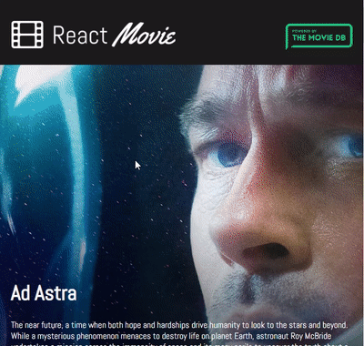

Project finished while completing Udemy course: Beginner React (2019). Create a Movie Web App

### Live Link

https://theketan2.github.io/movie-app/

### Topics covered

- React Fundamentals

- Components, props and state

- JSX syntax and expressions

- Fetching data from an external API

- Lifecycle Methods

- Use Create-React-App

- Deploy the finished App

- ES6+ concepts and syntax

- Use Local Storage to keep state

